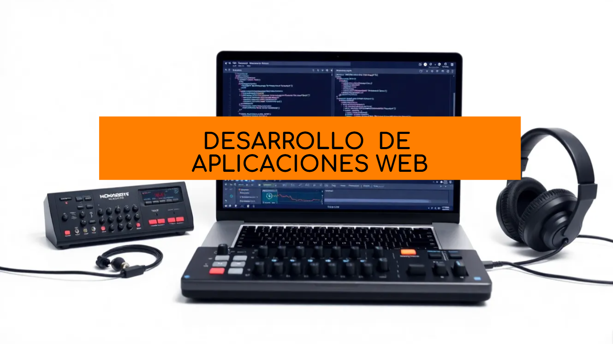

   

# 👋👋<ins>Hola, soy Ariel Orlando Cahuaza Huanca</ins>👋👋

## Soy un estudiante de <ins>**Deasarrolo de Aplicaciones Web**</ins> en el instituto <ins>**IES LUIS VIVES**</ins> y <ins>**Tecnico en Sistemas Microinformaticos y Redes**</ins>. Además de un gran apasionado por la <ins>**musica electronica**</ins> y <ins>**Dj en mi tiempo libre como hoobie**</ins>. Y el desarrollo de software me encanta porque es como crear al desde cero igual que una canción partiendo desde dos para crear una nueva. Dandole tu toque y estilo propio. Para crear tu propio sonido y estilo y diferenciarte de los demas.

----

&nbsp;
 
&nbsp;

&nbsp;

&nbsp;

---
## 📫📫 Contacto 

&nbsp;

---
## <ins>Aprendiendo a usar Herramientas Y Tecnologias como:</ins>

&nbsp;

&nbsp;

&nbsp;

&nbsp;

&nbsp;

&nbsp;

<!--
**ArielOrlando/ArielOrlando** is a ✨ _special_ ✨ repository because its `README.md` (this file) appears on your GitHub profile.

Here are some ideas to get you started:

- 🔭 I’m currently working on ...
- 🌱 I’m currently learning ...
- 👯 I’m looking to collaborate on ...
- 🤔 I’m looking for help with ...
- 💬 Ask me about ...
- 📫 How to reach me: ...
- 😄 Pronouns: ...
- ⚡ Fun fact: ...
-->
